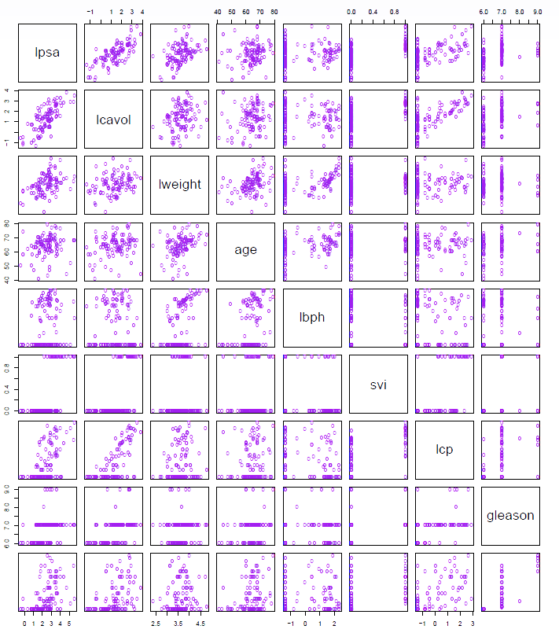
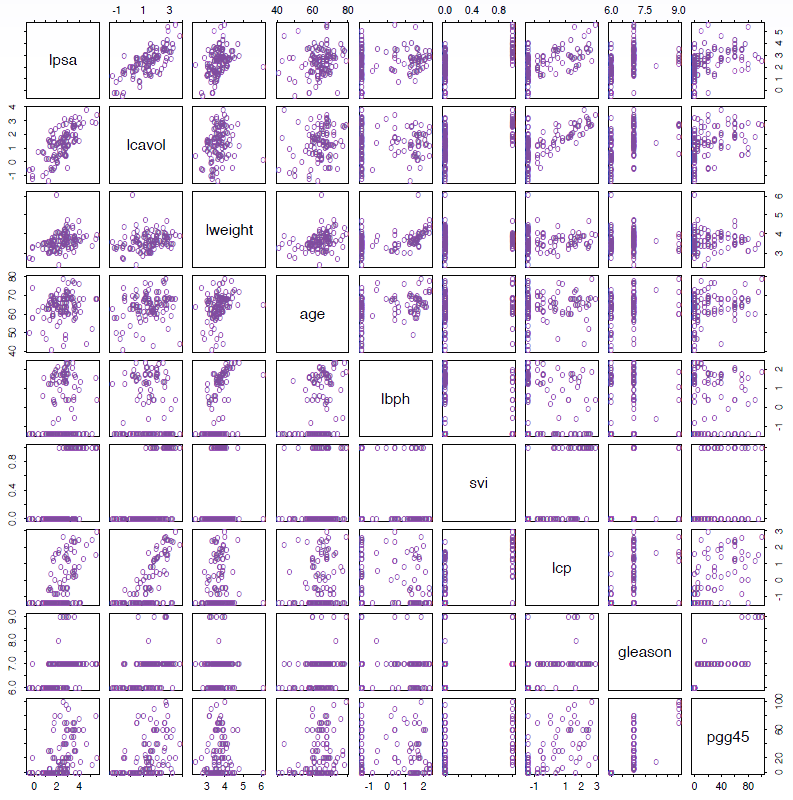
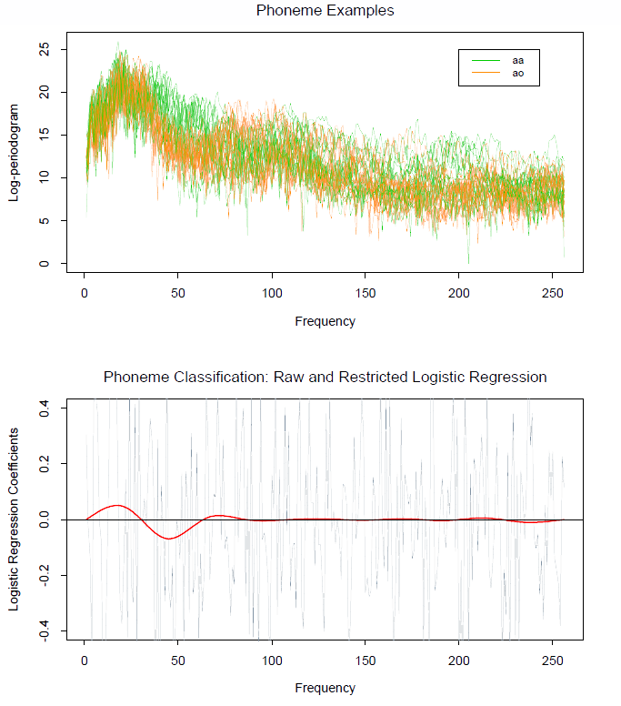
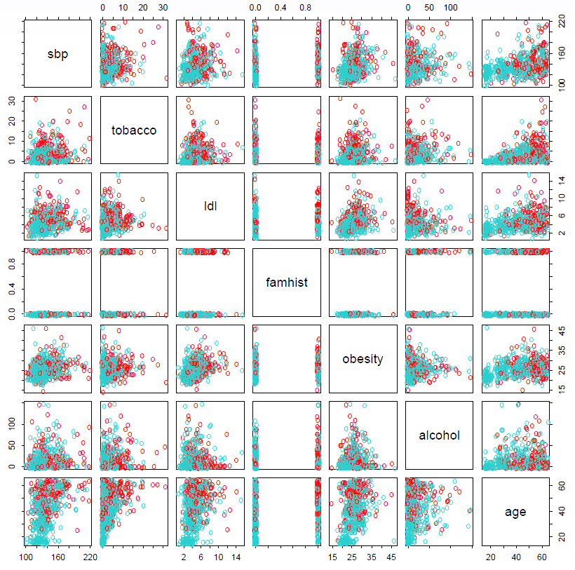
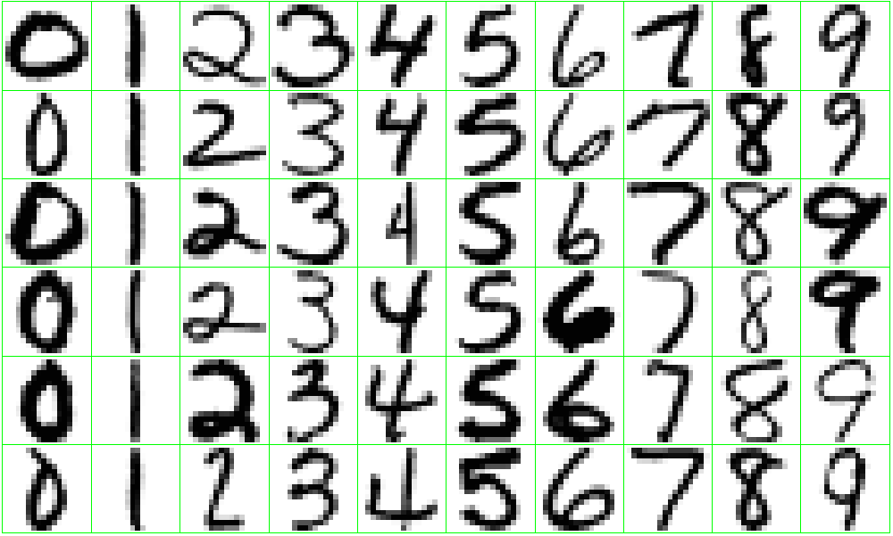
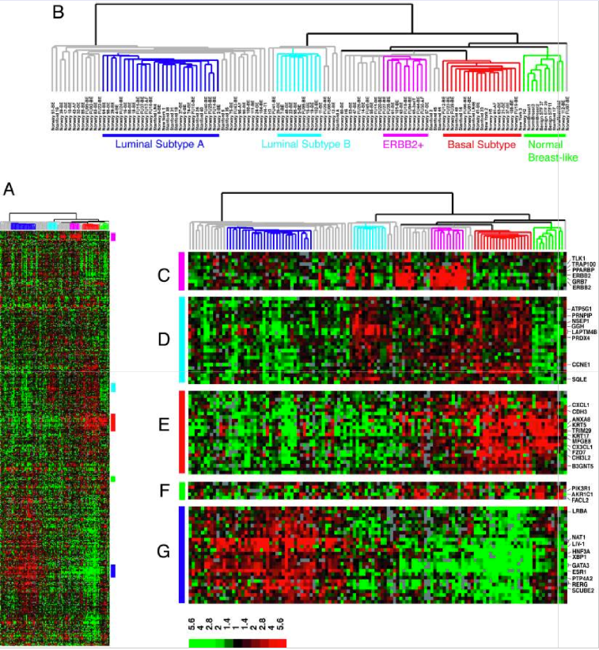
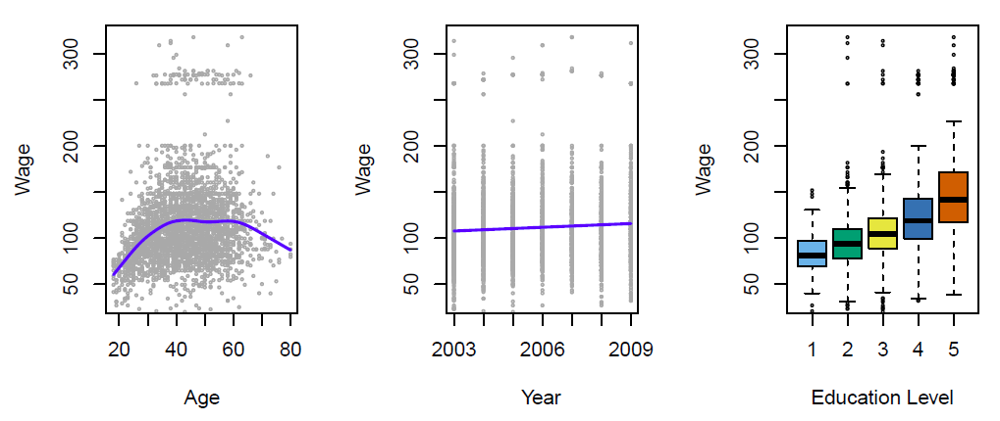
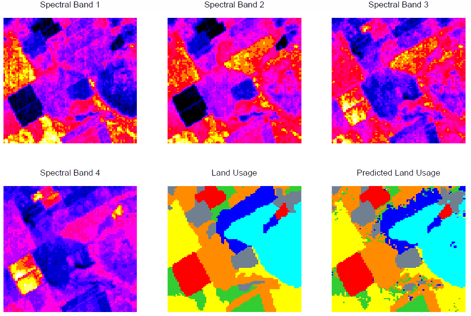

## Opening Remarks and Examples

<iframe width="560" height="315" src="https://www.youtube.com/embed/2wLfFB_6SKI?list=PL5-da3qGB5ICcUhueCyu25slvsGp8IDTa" allowfullscreen style="border:none; padding-top:25px">
</iframe>
*Tibshirani:* Hi I'm Rob Tibshirani

*Hastie:* and I'm Trevor Hastie. Welcome to our Course on Statistical
Learning.

*Tibshirani:* This is the first online course, and we are really excited
to tell you about it.

*Hastie:* and a little nervous as you can hear.

*Tibshirani:* What is statistical learning? Trevor and I are both
statisticians. We were actually graduate students here at Stanford in
the 80s. Back then we did applied statistics. Statistics have been
around since 1900 or before. But in the 1980s people in the field of
computer science developed the field of machine learning. Especially
Neural Networks became a really hot topic. I was at the University of
Toronto, and Trevor was at Bell Labs.

*Hastie:* and one of the first neural networks was developed at Bell
Labs to solve the zip code recognition problem, which we will show you a
little bit about in a few slides.

*Tibshirani:* Around that time, Trevor and I, and then some colleagues
Jerry Friedman, Bradley Effron. You will hear from Jerry and Brad in
this course, we have some interviews with them. About that time, we
started to work on the area of Machine Learning and developed our own
view of it, which is now called statistical learning. Along with
colleagues at Stanford and other places we developed statistical
learning.

*Slide 2:*

*Tibshirani:* In this course we will talk to you about some of the
developments in this area and give lots of examples. Let's start with
our first example which is a computer program playing Jeopardy called
Watson that IBM built. It beat the players in a three game match, and
the people at IBM that developed the system said that it was really a
triumph of Machine Learning. A lot of really smart technology, both
hardware and software algorithms that were based on Machine Learning. So
this was a watershed moment for the area of artificial intelligence and
machine learning.

*Slide 3:*

*Hastie:* Google is a big user of data, and a big analyzer of data. Here
is a quote that came in the New York Times in 2009 from Hal Varian who
is the chief economist at Google "I keep saying that the sexy hob in the
next 10 years will be statisticians. And I'm not kidding." And indeed
there is a picture of Kary Grimes who was a graduate at Stanford
statistics. She was one of the first statisticians hired by Google. Now
Google has many statisticians.

*Slide 4:*

*Tibshirani:* Our next example, this is a picture of Nate Silver on the
right, and Nate has a masters in economics, but he calls himself a
statistician. He writes, or at least did write a blog called
FiveThirtyEight for the New York Times. In that blog he predicted the
outcome of the 2012 presidential election and senate elections very
well. In fact he got all the senate races right and the presidential
election he predicted very accurately using statistics. Using carefully
sampled data from various places and some careful analysis he did an
extremely accurate job of predicting the election. A lot of news outlets
weren't sure who was going to win.

*Hastie:* A pretty nerdy looking guy isn't he Rob.

*Tibshirani:* Yes but he's famous.

*Hastie:* He's like a Rock Star these days.

*Tibshirani:* We joke that when you're a statistician and you go to
parties and someone says "what do you do?" we say "I'm a statistician
they run for the door." But now we can say "we do machine learning" and
they still run for the door but they take a little longer to get there.

*Hastie:* We now call ourselves Data Scientists, it's a trendier word

*Slide 5:*

*Hastie:* We are now going to run through a number of statistical
learning problems. You can see that there are a bunch of examples on
this page and we are going to go through them one by one just to give
you a flavour of what sort of problems we are going to be thinking
about.

*Slide 6:*

*Prostate cancer matrix*

*Hastie:* The first data set we are going to look at is on prostate
cancer. This is a relatively small data set of 97 men who had prostate
cancer. It was sampled by a Stanford physician Dr. Stamy in the late
1980s. What we have is the PSA measurement for each subject along with a
number of clinical and blood measurements from the patient. Some
measurements on the Cancer itself, and some measurements from the blood.
The measurements to do with cancer deal with size and the severity of
the cancer. This is a scatter plot matrix which shows the data. See on
the diagonal is the name of each of the variables and each little plot
is a pair of variables. You get in one picture, if you have a relatively
small number of variables, you can see all of the data at once. You can
see the nature of the data, which variables are correlated and so on.
This is a good way of getting the view of your data and in this
particular case, the goal was to try and predict the PSA from the other
measurements. You can see that there is a correlation between these
measurements.

*Slide 7:*

*The same data plotted on a log scale*

*Hastie:* Here is another view of this data which looks rather similar
except in the one instance these variables are on the log scale. Notice
there is a point over here that looks like somewhat of an outlier. It
turns out on the log scale it looks a bit like an outlier, but when you
look on the normal scale it is enormous. That was a typo, and if that
was a real measurement that would say this patient would have a 449 gram
prostate. We got a message from a retired urologist Dr. Steven Link who
pointed this out and so we corrected an earlier published version of
this scatter plot.

*Tibshirani:* A good thing to remember is that the first thing you do
when you get a set of data analysis is not to run it though a fancy
algorithm, make some graphs, some plots, look at the data. I think the
old days before computers, people did that much more because it was
easier. You do it by hand, and the analysis took many hours. So people
would look at the data first much more. We need to remember that, even
with big data you should look at it first before you jump in with
analysis.

*Slide 8:*

*Tibshirani:* The next example is phonemes

*Slide 9:*

*Phoneme logistic regression model*

*Tibshirani:* for two vowel sounds. This is log periodigrams for two
different phonemes. The power and frequencies of two different phonemes:
aa and ao. How do you pronounce those Trevor?

*Hastie:* aa is aa and ou is ou

*Tibshirani:* As you can tell, Trevor talks funny, but hopefully during
the course you will be able to . As you can see the log periodogram of
various frequencies of these two vowel sounds spoken by different people
the orange and the green. And the goal here was to try and classify the
two vowel sounds based on the power and the frequency. On the bottom we
see a logit model fit to the data looking at trying to classify the two
classes from each other based on the power and frequencies.

*Hastie:* The logit model is from logistic regression. Which is used to
classify the two vowel sounds.

*Tibshirani:* We will cover in detail throughout the course. The
estimated coefficients from the logistic model are in the grey profiles
here in the bottom plot. You can see they are very non-smooth. You would
be hard pressed to tell where the important frequencies are. When you
apply a kind of smoothing, which we will also discuss in the course, we
use the fact that the nearby frequencies should be similar, which the
grey did not exploit. We get the red curve shows you pretty clearly that
the important frequencies, looks like the one vowel has more power
sounds around 25, and the other vowel has more power around 50.

*Slide 10:*

*Hastie:* Predict whether someone will have a heart attack on the basis
of demographic, diet and clinical measurements.

*Slide 11:*

*Heart disease risk factor matrix*

*Hastie:* These are some data on men from South Africa. The red ones are
those that had heart disease, and the blue points are those that didn't.
It is a case control sample so heart attack cases were taken as cases
and a sample of the controls were made. The idea was to understand the
risk factors in heart disease. When you have a binary response like this
you can colour the scatterplot matrix so that you can see the points is
rather handy. These data come from a region of South Africa where the
risk of heart disease is very high. It is over 5% for this age group.
People, especially men around there eat lots of meat. They have meat for
all three meals and in fact meats are so prevalent, chicken is regarded
as a vegetable. You can see there are correlations in this data and the
goal here is to build a model that jointly involves all of these
different risk factors is coming up for a risk model for heart disease.
In this case that is coloured in red.

*Slide 12:*

*Tibshirani:* Our next example is email spam detection.

*Slide 13:*

*Spam and ham word frequencies*

*Tibshirani:* Everyone uses email and spam is definitely a problem. Spam
filters are a very important application of statistical and machine
learning. The data in this table actually is from the late '90s, from HP
and a person names George. This was early in the days of email where
spam was not very sophisticated. What we have here is data from over
4000 emails sent to an individual named George at HP labs. Each one has
been hand labeled as being spam or good email. The goal here is to try
and classify spam from 'ham' (good email) based on the frequencies of
words in the email. Here we have a summary table of the more important
features. It's based on words and characters in the email. This is
saying if the email had the word "George" in it, it was more likely to
be good email than spam. Back then if your name was George and you saw
George in your email it was more likely to be good email. Nowadays spam
is much more sophisticated. They know your name, they know a lot about
your life and the fact that your name is in it may mean it is a smaller
chance it is actually good email. Back then, the spammers were much less
sophisticated. For example if your names was in it, it is high chance to
be good email. If remove was in the email, it probably said something
like don't remove.

*Hastie:* I think it says if you want to be removed from this list click
here. That is usually a spam.

*Tibshirani:* The goal wasn't to, and we'll talk about this example in
detail, to use the 57 features as a classifier together to predict
whether the email is spam or ham.

*Slide 14:*

*Hastie:* Identify the numbers in a handwritten zip code

*Slide 15:*

*Handwritten digits classification*

*Hastie:* This is what we alluded to earlier. Here are some handwritten
digits taken from envelopes and the goal is to, based on the image, to
say what the digit is. Classifying to the 10 digit classes. To humans
this looks like a pretty easy task, we are pretty good at pattern
recognition. Turns out it is a notoriously difficult task for computers.
They are getting better and better all the time. This was one of the
first learning tasks that were used to develop neural networks. Neural
networks were first brought about this problem. We thought this should
be an easy problem to crack, it turns out is really difficult.

*Tibshirani:* I remember the first time Trevor that we worked on a
machine learning problem was this problem. You were working at Ball
Labs, I visited Bell Labs, and you had just gotten this data and you
said "These people in artificial intelligence are working on this" and
we thought let's try some statistical methods. We tried discriminant
analysis, and we got an error rate of 8.5% in 20 minutes, and the best
error rate anyone had had was 4%-5%. We thought this is going to be
easy. We are already at 8% in 10 or 15 minutes, 6 months later we were
at the same place. As often is the case, you can get some of the signal
pretty quickly, but getting down into a very good error rate, in this
case trying to classify some of the harder to classify things like this
4. Most of these are pretty easy, but if you look at the data base, some
of them are very hard. So hard that the human eye can't even tell what
they are, or has difficulty. Those are the ones that machine learning
algorithms are really challenged by.

*Hastie:* It's a lovely problem, and it's fascinated machine learners
and statisticians for a long time.

*Slide 16:*

*Tibshirani:* The next example comes from medicine, and is classifying a
tissue sample into one of several cancer classes, based on a gene
expression profile. Trevor and I both work in the medical school part
time here at Stanford

*Slide 17:*

*Gene expression data from breast cancer patients*

*Tibshirani:* and a lot of what we do is to use machine learning,
statistical learning, and big data analysis to learn about data in
Cancer and other diseases. This is an example of that. This is data from
breast cancer. It is called gene expression data. This has been
collected from gene chips. What we see here on the left is a matrix of
data. Each row is a gene; there are about 8000 genes here. Each column
is a patient. This is a heat map. What this heat map is representing is
low and high gene expression for a given patient for a given gene. Green
means low, and Red means high. Gene expression means that the gene is
working hard in the cell. The goal was to try and figure out the pattern
of gene expression, these were women with breast cancer, trying to
figure out the common patterns of gene expression for women with breast
cancer and seeing why there are sub categories for breast cancer showing
different gene expression. What we see here is a heat map of the full
data, 88 women in the columns, and about 8000 genes in the rows.
Hierarchical clustering which we discuss in the last part of this course
is going to be applied to the columns, and you can see the clustering
tree here at the top is expanded for you view. Hierarchical clustering
is used to divide these women into roughly six sub groups based on the
gene expression.

*Hastie:* It's very effective especially with these colours. It is easy
to see these clusters standing out.

*Tibshirani:* Hierarchical clustering and heat maps have been an
important contribution for genomics, which this is an example of. They
enable you to see and organize the full set of data in a single picture.
The bottom right here we drilled down to look more at the gene
expression, for example this sub group here, these red patients seem to
be high in these genes and these genes. We'll talk about this example
later in the course.

*Slide 18:*

*Hastie:* Establish the relationship between salary and demographic
variables in population survey data

*Slide 19:*

*Income survey data*

*Hastie:* Here is some survey data. We see income from the central
Atlantic region of the USA in 2009. You see what you might expect to see
as a function of age, income initially goes up and goes down as people
get older. Incomes gradually increase with year as the cost of living
increases. Incomes change with education level. We see three of the
variable that effect income. The goal is to use regression models to
understand the roles of these variables together and to see if there are
interactions.

*Slide 20:*

*Tibshirani:* Our last example is to classify LANDSAT images of land use
in Australia.

*Slide 21:*

*Spectral classification*

*Tibshirani:* This is a rural area of Australia where the land use has
been labeled by graduate students into one of 6 categories. The goal is
to try and predict the true labels by the spectral bands of 4
frequencies taken from a satellite image. Here is the power of different
frequencies by spectral bands. We have spatial features, four layers of
them, and we are going to use a combination of them to predict the land
use that we see here. Pixel by pixel. We might want to use the fact that
nearby pixels are more likely to be the same land use than ones that are
far away. We'll talk about classifiers, the one we use here is nearest
neighbours, a simple classifier, and that produces the picture on the
bottom right. It is quite good, not perfect it makes a few mistakes, but
it is for the most part quite accurate.

*Hastie:* That is the end of the series of examples, in the next session
we will tell you some notation and how we set up problems for supervised
learning, which we will use for the rest of the course.

Supervised and Unsupervised Learning
====================================

<iframe width="560" height="315" src="https://www.youtube.com/embed/LvaTokhYnDw?list=PL5-da3qGB5ICcUhueCyu25slvsGp8IDTa" style="border:none; padding-top:25px" allowfullscreen>
</iframe>
*Hastie:* OK, now we're going to talk about the supervised learning
problem and set down a little bit of notation. So we'll have an outcome
measurement *Y*, which goes by various names, dependent variable,
response, or target. And then we'll have a vector of *p* predictor
measurements, which we usually call *X*. They go by the name inputs,
regressors, covariates, features, or independent variables. And we
distinguish two cases. One is the regression problem; *Y* is
quantitative, such as price or blood pressure. In the classification
problem, *Y* takes values in a finite, unordered set, such as survived
or died the digit classes zero to nine, the cancer class of the tissue
sample. Now we have training data pairs.
(*x*1, *y*1), (*x*2, *y*2),
up to (*x**N*, *y**N*). So again, *x*1
is a vector of *p* measurements, *y*1 is usually a single
response variable. And so these are examples or instances of these
measurements.

*Slide 23:*

*Hastie:* So the objectives of supervised learning are as follows. On
the basis of the training data, we would like to accurately predict
unseen test cases, understand which inputs affect the outcome and how,
and also to assess the quality of our predictions and the inferences.

*Slide 24:*

*Tibshirani:* So by way of philosophy, as you take this course, we want
not just to give you a laundry list of methods, but we want you to know
that it is important to understand the ideas behind the various
techniques, so you know where and when to use them. Because in your own
work, you're going to have problems that we've never seen before, you
never seen before, and you want to be able to judge which method are
likely to work well and which ones are not likely to work well. As well,
not just prediction accuracy is important, but it's important to do to
try simpler methods first in order to grasp the more sophisticated ones.
We're going to spend quite a bit of time on linear models, linear
regression, and linear logistic regression. These are simple methods,
but they're very effective. And it's also important to understand how
well method is doing. It's easy to apply an algorithm. Nowadays you can
just run software, but it's difficult but also very important to figure
out how well is the method actually working so you can tell your boss or
your collaborator that, when you apply this method we developed, how
well you're likely to do it tomorrow. And in some cases, you won't do
well enough to actually use the method, and you'll have to improve your
algorithm or maybe collect better data. The other thing we want to
convey just through the course and hopefully through examples is that
this is a really exciting area in research. I mean, statistics in
general is very hot area. Statistical learning and machine learning is
of more and more importance, and it's really exciting that the area's
not gelled in anyway in the sense that there's a lot of good methods out
there, but a lot of challenging problems aren't solved. Especially in
recent years, Rob, with the onset of big data and coined the word data
science. Right, and statistical learning has is a fundamental ingredient
in this new area of data science. So you might be wondering where's the
term supervised learning come from? It's actually a very clever term,
and I would like to take credit for it, but I can't. It was developed by
someone in the machine learning area. The idea of supervised learning,
I'm thinking in kindergarten of a teacher trying to teach a child to
discriminate between what, say, a house is and a bike. So he might show
the child, maybe Johnny, say Johnny, here are some examples of what a
house looks like. And maybe in LEGO blocks. And here's some examples of
what a bike looks like. He tells Johnny this and shows him examples of
each of the classes. And the child then learns, oh I see. Houses got
sort of square edges, and a bike has got some more rounded edges, et
cetera. That's supervised learning, because he's been given examples of
label training observations. He's been supervised. And as Trevor just
sketched out on the previous slide, the *Y* there is given and the child
tries to learn to classify the two objects based on the features, the
*X*'s.

*Slide 25:*

*Tibshirani:* Now, unsupervised learning is another thing that we're
talking in this course. Which I grew up with. See, that's the problem.
So in unsupervised learning, now in the kindergarten, Trevor's in
kindergarten, and Trevor was not given examples of what a house and a
bike was. He just sees on the ground lots of things. He sees maybe some
houses, some bikes, some other things. And so this data is unlabeled.
There's no *Y*. I was pretty sharp. So the problem there now is for the
child, it's unsupervised, to try to organize in his own mind the common
patterns of what he sees. He may look at the objects and say, oh these
three things are probably houses. Or he doesn't know they're called
houses, but they're similar to each other because they have common
features. These other objects, maybe they're bikes or other things,
they're similar to each other, because I see some commonality. And that
brings the idea of trying to group observations by similarity of
features, which is going to be a major topic of this course,
unsupervised learning. So more formally, there's no outcome variable
measure, just a set of predictors. And the objective is more fuzzy. It's
not just to predict Y, because there is no Y. It's rather to learn about
how the data is organized, and to find which features are important for
the organization of the data. So we'll talk about the clustering of
principle components which are important techniques for unsupervised
learning. One of the other challenges is it's hard to know how well
you're doing. There's no gold standard. There's no Y. So when you've
done a clustering analysis, you don't really know how well you've done.
And that's one of the challenges. But nonetheless, it's an extremely
important area. One reason is that the idea of unsupervised learning is
an important preprocessor for supervised learning. It's often useful to
try to organize your features, choose features based on the X's
themselves, and then use those processed or chosen features as input
into supervised learning. And the last point is that it's a lot easier,
it's a lot more common to collect data which is unlabeled. Because on
the web, for example, if you look at movie reviews, a computer algorithm
can just scan the web and grab reviews. Figuring out whether review, on
the other hand, is positive or negative often takes human intervention.
So it's much harder and costly to label data. Much easier just to
collect unsupervised, unlabeled data.

*Slide 26:*

*Hastie:* The last example we're going to show you is a wonderful
example. It's the Netflix prize. Netflix is a movie rental company in
the US, and now you can get the movies online. There used to be DVDs
that were mailed out. And Netflix set up a competition to try and
improve on their recommender system. So they created a data set of
400,000 Netflix customers and 18,000 movies, and each of these customers
that rated on average around 200 movies each. So each customer had only
seen about 1% of the movies. And so you can think of this as having a
very big matrix which was very sparsely populated with ratings between
one and five. And the goal is to try and predict, as in all recommender
systems, to predict what the customers would think of the other movies
based on what they rated so far. So Netflix set up a competition where
they offered a $1 million prize for the first team that could improve on
their rating system by 10% by some measure. And the design of the
competition is very clever. I don't know if it was by luck or not, but
they are root-mean-square error of the original algorithm was about
9.953. So that's on a scale of, again, one to five. And it took the
community, when they announced the competition and put the data on the
web, it took the community about a month or so to have an algorithm
which improved upon that. But then it took the community about another
three years to actually for someone to win the competition.

*Slide 27:*

*Hastie:* It's a great example, here's the leader's board at the time
the competition ended. It was eventually won by a team called BellKor's
Pragmatic Chaos. But a very close second was Ensemble. In fact, they had
the same score up to four decimal points. And the final winner was
determined by who submitted the final predictions first. So it was a
wonderful competition, but what was especially wonderful was the amount
of research that it generated. Tens of thousands of teams all over the
world entered this competition over the period of three years, and a
whole lot of new techniques were invented in the process. A lot of the
winning techniques ended up using a form of principal components in the
presence of missing data. How come our name's not on that list, Trevor?
Where's our team? That's a good point, Rob. The page isn't long enough.
I think if we went down a few hundred, you might. So actually,
seriously, we actually tried with a graduate student when the
competition started. We spent about three or four months trying to win
the competition. And one of the problems was computation. The data was
so big and our computers were not fast enough. Just to try things out
took too long. And we realized that the graduate student was probably
not going to succeed and was probably going to waste three years of his
graduate program, which was not a good idea for his career. So we
basically abandoned ship early on.

*Slide 28:*

*Tibshirani:* So I mentioned in the beginning the field of machine
learning, which actually led to the statistical learning area which
we're talking about in this course. And machine learning itself arose as
a sub field of artificial intelligence, especially with the advent of
neural networks in the '80s. So it's natural to wonder what's the
relationship between statistical learning and machine learning. First of
all, the question's hard to answer. We ask that question often. There's
a lot of overlap. Machine learning tends to work at larger scales. They
tend to work on bigger problems. Although again, the gap tends to be
closing because fast computers now are becoming much cheaper. Machine
learning worries more about peer prediction and how well things predict.
Statistical learning also worries about prediction but also tries to
come up with models, methods that can be interpreted by scientists and
others. And also by how well the method is doing. We worry more about
precision and uncertainty. But again, the distinctions become more and
more blurred, and there's a lot of cross-fertilization between the
methods. Machine learning clearly has the upper hand in marketing. They
tend to get much bigger grants and their conferences are much nicer
places, but we're trying to change that, starting with this course.

*Slide 29:*

*Hastie:* So here's the course text, Introduction to Statistical
Learning. We're very excited. This is a new book by two of our graduate
students, past graduate students, Gareth James and Daniela Witten and
Rob and myself. Book just came out in August, 2013. And this course will
cover this book in its entirety. The book has at the end of each
chapter, there's examples run through in our computing language. And we
do sessions on R. And so when you do this course, you will actually
learn to use R as well. R is a wonderful environment. It's free, and
it's a really nice way of doing data analysis. You see there's a second
book there, which is our more advanced textbook, Elements of Statistical
Learning. That's been around for a while. That will serve as a reference
book for this course for people who want to understand some of the
techniques in more detail. Now the nice thing is, not only is this
course free, but these books are free as well. The Elements of
Statistical Learning has been free, and the PDF is available on our
websites. This new book is going to be free beginning of January when
the course begins. And that's with agreement with the publishers. But if
you want to buy the book, that's OK, too. It's nice having the hard
copy. But if you want, the PDF is available. So we hope you enjoy the
rest of the class.
