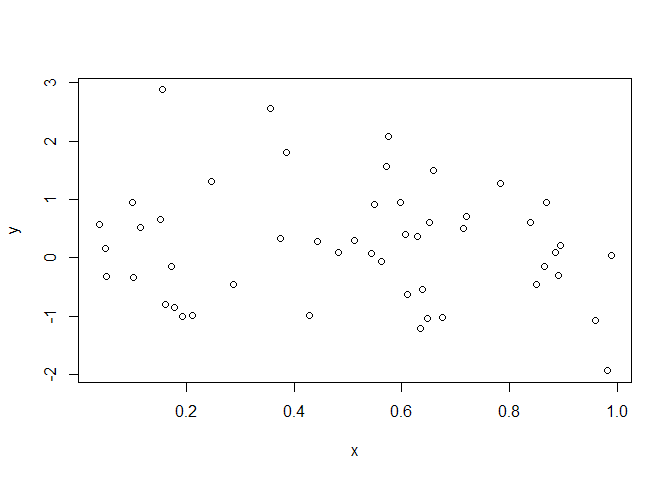
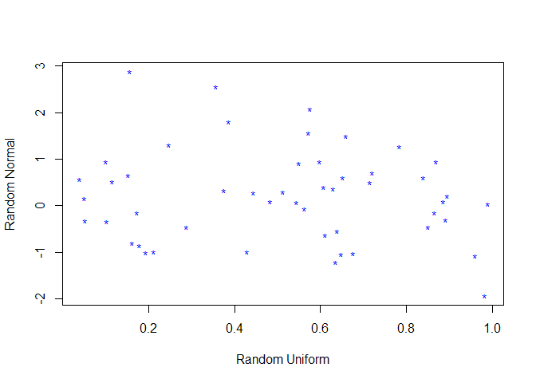
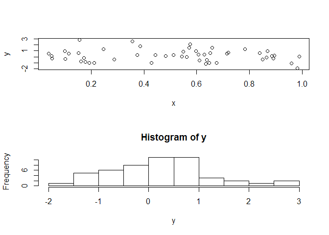
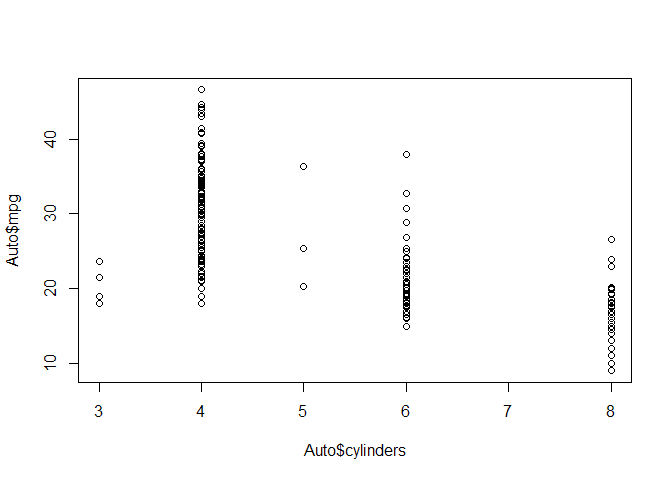
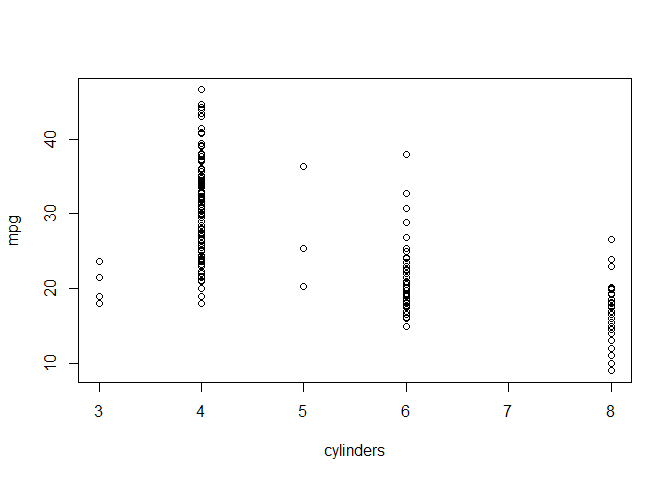

<center>
<iframe width="560" height="315" src="https://www.youtube.com/embed/jwBgGS_4RQA?list=PL5-da3qGB5IDvuFPNoSqheihPOQNJpzyy" style="border:none;" allowfullscreen></iframe>
</center>
<br>
*Hastie:* Hi again. What we're going to do now, is we're going to have a look at R. Doing data analysis, these days, definitely requires a very good computing environment. And there's lots around. But from my point of view R is probably be the best environment these days. R is free, as we've mentioned before. And it's got a vast range of capabilities. And there it's got quite a steep learning curve, but the more you learn, the more capable you become. So R allows you to do all kinds of basic operations and data. And it's also got lots of built-in packages. And once you learn or R, you'll discover its also good very beautiful graphics. And after a while, you'll find that to start writing functions yourself, and expanding your abilities. So really, R, and/or tools like R are fundamental to doing good data analysis and statistical modeling. And so we're making this an essential part of this course. So what I'm doing here is I'm actually running R in another free program called R-Studio. So that's just an environment for running R and for developing presentations in R. And it's convenient for giving a presentation of this kind. So we'll now go to an introductory session in R-Studio, and I'll just show you some of the features of R. So here we are. You'll see I've got a script in the R-Studio session, in the top left panel. And in the bottom left panel, there's the R work in session. And what's going to happen is I'm going to click on commands that I've pre-entered, and that will get sent to the R session window and executed. Now of course, I could have tried to do you do this live and just type in the commands, but I don't touch type, and that would have been painful for you and me. So here we go. 

So the first thing we'll do is just see, working with basic vectors and matrices. So here we assign three numbers to a vector x. And you see the commands going down below. And if we just type in `x`, it will print the vector. And there we see the three numbers.

```r
x = c(2,7,5)
x
## [1] 2 7 5
```
Now there's many ways of creating vectors. So here's another way, making a sequence, starting from 4, and having length 3, and in steps by 3. So that's a kind of natural thing one would want to do. This command, `seq`, is actually very useful. And if you want to find out more about it, in R the way to get help on functions and objects is to put a `?` in front. So we do `?seq`, and in R-Studio, on the right panel, we see the panel comes up giving us all the options for `seq`. And you'll see there's quite a few options in the command `seq` that let you make sequences in flexible ways. If we type `y`, we see the values. And as you might have expected, we see 4, 7, and 10.

```r
y = seq(from=4, length=3, by=3)
y
## [1]  4  7 10
```
So now I've got two vectors, x and y, both of the same length. And now we can do things with them. And R does vector operations in parallel. So if we say `x+y`, even though they're both vectors, we get the sum of those two vectors, element by element. And likewise, other operations, like `x/y` means x divide y, and it does element-wise division of the elements. And you can do `x^y`, and it'll do element-wise exponentiation. Oh, that gave us a rather big number over there.

```r
x+y
## [1]  6 14 15
x/y
## [1] 0.5 1.0 0.5
x^y
## [1]      16  823543 9765625
```
So that's some simple operations for creating vectors. What about accessing elements of a vector? Well, so there's a subscript convention in R using `[ ]`. So `x[2]` gives us the second element of x. 

```r
x[2]
## [1] 7
```
If we go `x[2:3]`, that says we want the elements of x starting from element 2 and ending at element 3. OK. So it gives us the two values.

```r
x[2:3]
## [1] 7 5
```
And a very convenient option in R for subsetting is to put negative signs in subscripts. So `x[-2]` means remove the element 2 from x, and return the subsetted vector. 

```r
x[-2]
## [1] 2 5
```
And so there we see that's done. And you can remove more than one element at a time. And so here, `x[-c(1,2)]`, we're moving the collection of indices 1 and 2, and they can be arbitrary collection of indices. And that just gives us a vector of length 1. 

```r
x[-c(1,2)]
## [1] 5
```
Something to note, there's no scalars in R. Everything's a vector. So a scalar is just a vector of length 1. OK. So those are vectors. 

The next higher up object we're interested in are matrices. So matrices, and as a case of another array, you can high dimensional arrays, as well, in R. A matrix is a two-way array. And here's a simple way of making a matrix. So here we've got `z = matrix(seq(1,12),4,3)`. And we give it the numbers 1 to 12. So the first arguments are the actual numbers in the matrix. And then we give it the dimensions 4 and 3. So we want to make a 4 by 3 matrix. And there it is. 

```r
  z <- matrix(seq(1,12),4,3); z
##      [,1] [,2] [,3]
## [1,]    1    5    9
## [2,]    2    6   10
## [3,]    3    7   11
## [4,]    4    8   12
```
And so you see it's taken the numbers in column order, which is a convention in R. And so now, just like with vectors, we can subset elements of a matrix with `[ ]`. So here we want to see the third and fourth row, and the second and third column. 

```r
  z[3:4,2:3]
##      [,1] [,2]
## [1,]    7   11
## [2,]    8   12
```
And if I just put a comma and ignore the first index, you'll just get the columns. So this gives us a second and third column of z. 

```r
z[ ,2:3]
##      [,1] [,2]
## [1,]    5    9
## [2,]    6   10
## [3,]    7   11
## [4,]    8   12
```
And there is the first column of z.

```r
z[ ,1] 
## [1] 1 2 3 4
```
Now notice what's happened. When we took just the first column of z, that became a vector and it actually dropped its matrix status. Sometimes that's convenient. But a lot of the time, it's not, especially when your programming and you don't want to accidentally lose the status of a matrix. So the matrix subsetting has an argument, `drop`, and here we say, `drop=FALSE`, and it keeps that one column matrix as a matrix, and not a vector.

```r
z[ ,1, drop=FALSE] 
##      [,1]
## [1,]    1
## [2,]    2
## [3,]    3
## [4,]    4
```
So there are various functions. You could query the dimension of a matrix. So `dim(z)` gives you the dimensions of the matrix.

```r
dim(z)
## [1] 4 3
```
So those are vectors and matrices. `ls()` is a very nice command. It tells you what you have available in your working directory. And so we've got a number of variables there. The ones we've just made are x, y, and z. You can clean up your working directory. So for example, you can use the `rm()` command to remove y. And there we see y is gone. 

```r
ls()
## [1] "x" "y" "z"
rm(y)
ls()
## [1] "x" "z"
```

OK. So that's making data, sort of directly. There's other convenient ways, especially in statistics. You can often be doing simulations to test out routines, and to test out ideas. And so we need a good suite of tools for generating data. So `runif()` is random uniform. So this command will create 50 random uniforms on 0, 1.

```r
x<-runif(50)
```
And rnorm, is random norm, random gaussians, random normal variables. It will create 50 standard random normal variables.

```r
y<-rnorm(50)
```
And let's look at a plot of these variables. And so we plot x and y. And there we get a plot.

```r
plot(x,y)
```


Now I must say, R graphics is really well designed. One doesn't think too much about the design of graphics, but a lot goes into it, such as aspect ratios, how much space to put around the points on a plot, between the edge of the points and the axes. Just things like spacing of the axes, how many ticks, and so on. That all seems like trivial details, but it's not. And this has been carefully thought of and designed. And therefore, R graphics, I think, are particularly attractive. Of course, I may be a little impervious since I've been an R, and its predecessor S, user for many, many years. So you could put, or you can annotate your plots. And add all kinds of features to your plots. So there's the same plot, but we changed the plotting character, and we put axis labels.

```r
plot(x,y,xlab="Random Uniform",ylab="Random Normal",pch="*",col="blue")
```


And there are many, many options for making plots. Here's an option. And the `par()` command allows you to set some of these options. Some you can do directly in the plot command, and some, like layout commands, you can set with `par()`. So this is one that's often used, `mfrow`. It says we want to have a panel of plots with two rows and one column. And so that we do with the `mfrow` command. And so now, if we do the same plot, in our plot region, you'll see it's a little squashed up now, because we want two plots in this region. And so in the second part of the region, we're going to do a histogram of y.

```r
par(mfrow=c(2,1))
plot(x,y)
hist(y)
```


And so that `mfrow`, that division will stay in place until you reset it with another `mfrow` command. And so there, we've reset it. 

So we've created data manually. We've generated data using random number generators. And we saw uniform and normal. And there are many other distributions you can generate from. OK. So now we will read in some data that we've got in the system. For example, Excel is often the place where you store your data. And so we're going to read that. There's ways of doing this in R. So we use the `read.csv()` function. And this requires that you've saved your data in comma separated value from Excel. And then you can just read it in, in R, and it respects the rows, and columns, and the headings, and everything else. And of course, you need to know where the data is. In this case, I know where the data is. If not, you'll get an error. 

```r
Auto=read.csv("~/Desktop/Rsessions/Auto.csv")
```
And so now we can query the data that we have just read in. And you can see it's got a number of columns. And those are the names of the variables. And we can look at the dimension of the data. It's 397 by 9. And we can see, what is this object that we read in?

```r
link = getURL("https://raw.githubusercontent.com/asadoughi/stat-learning/master/data/Auto.csv")
Auto = read.csv(text = link)

names(Auto)
## [1] "mpg"          "cylinders"    "displacement" "horsepower"  
## [5] "weight"       "acceleration" "year"         "origin"      
## [9] "name"
dim(Auto)
## [1] 397   9
class(Auto)
## [1] "data.frame"
```
{:refdef: style="text-align: center;"}
*For the purpose of this tutorial, we will be importing the data from a URL*
{: refdef:}

The class of order is a data frame. And you'll learn more about data frames. They're very valuable objects. It's sort of like a matrix, except that the columns can be variables of different kinds. So you can have what we call factors, and continuous variables, and matrices, and so on, which is really the way we think of observations in statistics. `Summary` is a useful function for a data frame. It'll give you a summary of each of the variables in the data frame. And you can see its things like min, max, and so on.

```r
summary(Auto)
##       mpg          cylinders      displacement     horsepower 
##  Min.   : 9.00   Min.   :3.000   Min.   : 68.0   150    : 22  
##  1st Qu.:17.50   1st Qu.:4.000   1st Qu.:104.0   90     : 20  
##  Median :23.00   Median :4.000   Median :146.0   88     : 19  
##  Mean   :23.52   Mean   :5.458   Mean   :193.5   110    : 18  
##  3rd Qu.:29.00   3rd Qu.:8.000   3rd Qu.:262.0   100    : 17  
##  Max.   :46.60   Max.   :8.000   Max.   :455.0   75     : 14  
##                                                  (Other):287  
##      weight      acceleration        year           origin     
##  Min.   :1613   Min.   : 8.00   Min.   :70.00   Min.   :1.000  
##  1st Qu.:2223   1st Qu.:13.80   1st Qu.:73.00   1st Qu.:1.000  
##  Median :2800   Median :15.50   Median :76.00   Median :1.000  
##  Mean   :2970   Mean   :15.56   Mean   :75.99   Mean   :1.574  
##  3rd Qu.:3609   3rd Qu.:17.10   3rd Qu.:79.00   3rd Qu.:2.000  
##  Max.   :5140   Max.   :24.80   Max.   :82.00   Max.   :3.000  
##                                                                
##              name    
##  ford pinto    :  6  
##  amc matador   :  5  
##  ford maverick :  5  
##  toyota corolla:  5  
##  amc gremlin   :  4  
##  amc hornet    :  4  
##  (Other)       :368
```
Horsepower, for example, is a categorical variable, so it actually gives you all the values. And the name of the automobile is also categorical. It's an effective variable. It gives you the values. So data frames and summary of data frames is very useful. 

Now you can plot the elements of a data frame. So a data frame is also a list. And a list, you get the elements of the list by giving the name of the list, which is `Auto` here, and then use `$`. And then you can give the name, `Auto$cylinders`. So that's one way of getting the elements of a list. And so here, we want to plot the column cylinders against the column miles per gallon, MPG. And so we access both of those in the same way. And so there we have. Here's the plot. 


```r
plot(Auto$cylinders,Auto$mpg)
```


And so you can see that cylinders also take on discrete values. And yeah, we do cylinders against miles per gallon. So that's a little cumbersome, having to do that dollar indexing of the elements of the data frame. So what you can actually do is you can `attach()` the data frame. 

```r
attach(Auto)
```
And what it does is it creates a workspace with all the named variables as now variables in your workspace. So now you can access them by name. OK. And so if we do issue the command `search()`, it tells us our various workspaces. 

```r
search()
##  [1] ".GlobalEnv"        "Auto"              "package:RCurl"    
##  [4] "package:bitops"    "package:tufte"     "package:stats"    
##  [7] "package:graphics"  "package:grDevices" "package:utils"    
## [10] "package:datasets"  "package:methods"   "Autoloads"        
## [13] "package:base"
```
And there we see the global environment is where we've put all our vectors, like x, y, and z, and the variables we've created in the session. But this data frame that we've attached is in the second position here. And it's got the variables that are in the order data frame available for our direct use. And you'll see there are other things in the Search path, as well. And these are largely packages, at this point, whose functions we have available. So now we can do that plot command more directly. And here, we've plotted cylinders and miles per gallon.


```r
plot(cylinders, mpg)
```


And we see, for each level of cylinders, we get a plot of the values for miles per gallon, which is like a little one dimensional summary of the values at that level of cylinder.
